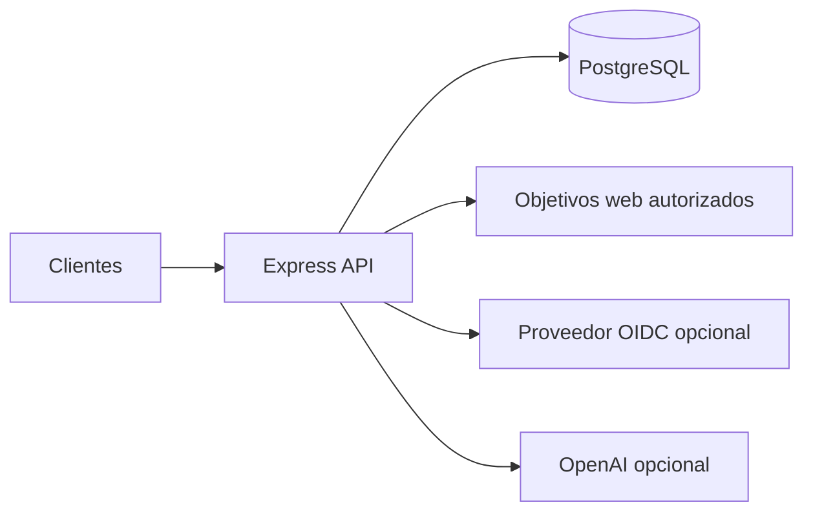

# Documentación del Backend

| Documento | Contenido |
| --- | --- |
| [Arquitectura](architecture.md) | Capas, contenedores y componentes |
| [API](api.md) | Autenticación y catálogo de endpoints |
| [Modelo de datos](data-model.md) | Entidades, relaciones y estados |
| [Casos de uso](use-cases.md) | Flujos funcionales principales |
| [Motor de diagnóstico](diagnostic-engine.md) | Alcance real, controles y puntuación |
| [IA y reportes](ai-and-reporting.md) | Proveedor generativo, motor local y PDF |
| [Seguridad](security.md) | Amenazas, MFA, OAuth2, JWT y auditoría |
| [Desarrollo y pruebas](development-and-testing.md) | Configuración, pruebas, Docker y CI/CD |

