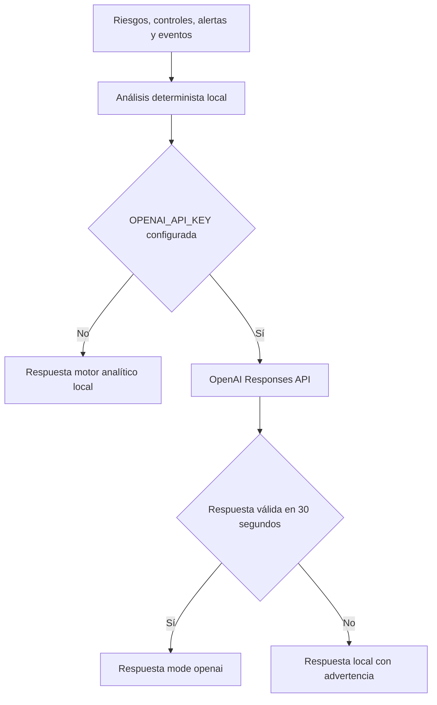
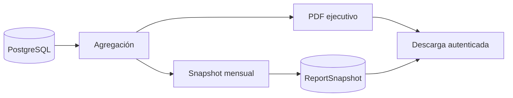

# Inteligencia artificial y reportes

## Selección del motor

El motor local calcula postura, probabilidad, tendencia, resumen y recomendaciones a partir de información persistida. OpenAI recibe ese contexto y una línea base, usa salida JSON Schema y tiene instrucción de no inventar evidencia.

## Límites

- `attack_probability` es un indicador heurístico, no una predicción estadística entrenada ni una garantía.
- La salida siempre incluye `mode`, lo cual permite identificar su procedencia.
- Ante ausencia, error o timeout de OpenAI se usa el motor local y se informa la advertencia del proveedor.
- No se deben enviar secretos, contraseñas ni contenido documental sensible al proveedor.
- Las recomendaciones requieren revisión humana antes de ejecutar cambios.

## Reportes

| Reporte | Endpoint | Fuente |
| --- | --- | --- |
| Ejecutivo | `GET /reports/executive.pdf` | Activos, riesgos y recomendaciones actuales |
| Mensual | `GET /reports/monthly` | Metadatos de snapshots persistidos |
| PDF mensual | `GET /reports/monthly/:id.pdf` | Contenido persistido en base64 |

Los documentos deben identificar período, fecha de generación, alcance y totales. Un snapshot preserva el resultado histórico aunque cambien los datos operativos.

## Evolución recomendada

Para afirmar IA predictiva basada en Machine Learning se requiere un conjunto histórico etiquetado, características versionadas, evaluación contra una línea base, métricas de precisión/calibración, monitoreo de deriva y gobierno del modelo.
