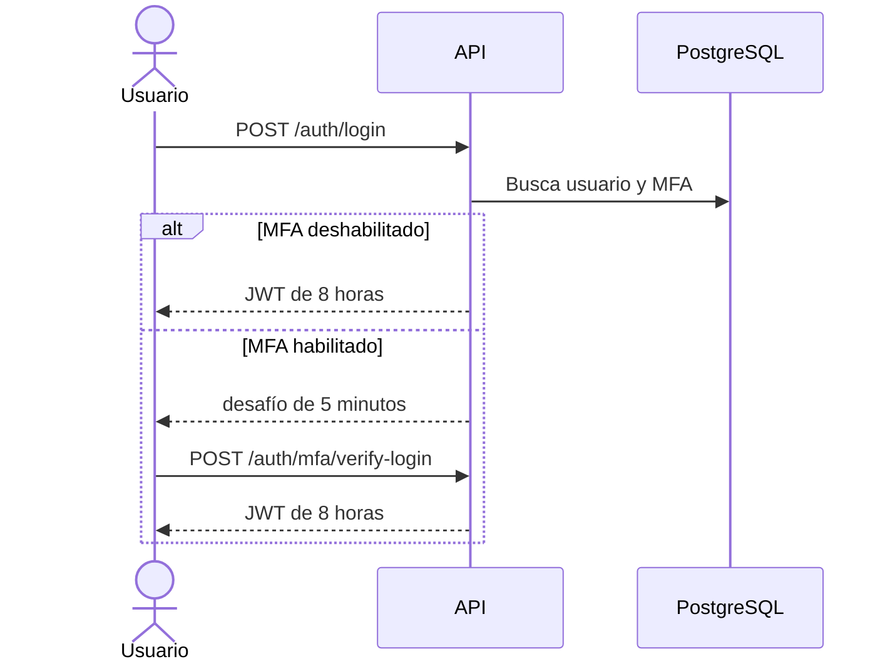

# API REST

Base: `/api/v1`. La documentación ejecutable está en `/docs`; el contrato JSON, en `/api/openapi.json`.

## Autenticación

| Método y ruta | Propósito | Pública |
| --- | --- | --- |
| `POST /auth/login` | Credenciales locales | Sí |
| `POST /auth/mfa/verify-login` | Completar desafío TOTP | Sí |
| `GET /auth/oauth/config` | Obtener URL OIDC | Sí |
| `POST /auth/oauth/callback` | Intercambiar código OIDC | Sí |
| `GET /auth/me` | Perfil vigente | No |
| `POST /auth/change-password` | Cambiar contraseña propia | No |
| `POST /auth/mfa/setup` | Crear secreto TOTP | No |
| `POST /auth/mfa/enable` | Habilitar TOTP | No |
| `POST /auth/mfa/disable` | Deshabilitar TOTP | No |

## Inventario, riesgo y resumen

| Recurso | Endpoints |
| --- | --- |
| Activos | `GET, POST /assets`; `GET, PUT, DELETE /assets/:id` |
| Riesgos | `GET, POST /risks`; `GET, PUT, DELETE /risks/:id` |
| Dashboard | `GET /dashboard` |
| Recomendaciones | `GET /recommendations` |
| PDF ejecutivo | `GET /reports/executive.pdf` |

## Operación y gobierno

| Recurso | Endpoints |
| --- | --- |
| Resumen de seguridad | `GET /security/overview` |
| Diagnósticos | `GET, POST /scans` |
| Monitores | `GET, POST /monitors`; `POST /monitors/:id/check`; `DELETE /monitors/:id` |
| Alertas | `GET /alerts`; `PUT /alerts/:id` |
| Cumplimiento | `GET /compliance`; `PUT /compliance/:id`; `POST /compliance/automatic-assessment` |
| Documentos | `GET, POST /documents`; `GET, DELETE /documents/:id` |
| Eventos | `GET, POST /events` |
| Incidentes | `GET, POST /incidents`; `PUT /incidents/:id`; `POST /incidents/:id/respond` |
| IA | `GET /ai/analysis` |
| Auditoría | `GET /audit-logs` |
| Reportes mensuales | `GET /reports/monthly`; `GET /reports/monthly/:id.pdf` |

## Respuestas y errores

- JSON para recursos; PDF para endpoints `.pdf`.
- `201` creación, `204` eliminación, `400` validación, `401` autenticación, `404` recurso ausente, `500` error no controlado.
- Los errores siguen `{ "detail": "descripción" }`.
- Swagger es la referencia para esquemas de petición y respuesta; este catálogo explica el alcance funcional.
