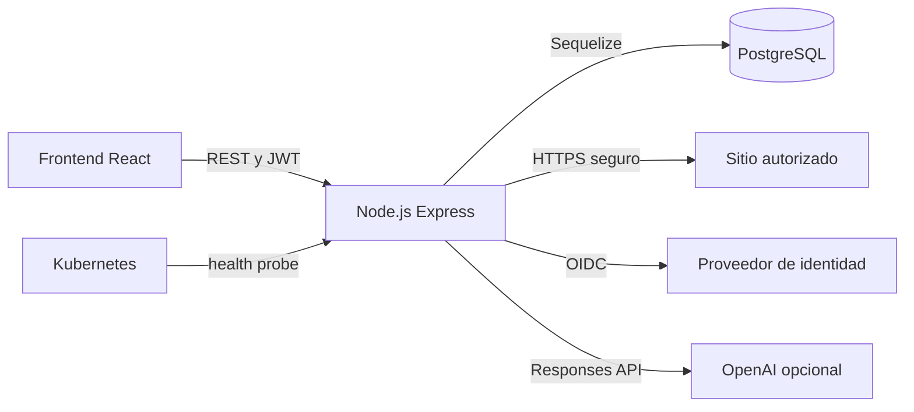
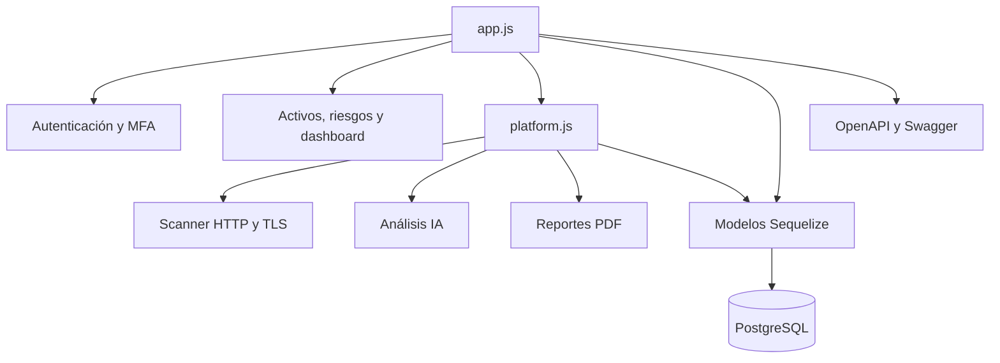

# Arquitectura del Backend

## Vista de contenedores

## Componentes

## Responsabilidades

| Componente | Responsabilidad |
| --- | --- |
| `app.js` | Middleware, autenticación, activos, riesgos, dashboard y errores |
| `platform.js` | Diagnóstico, operación, cumplimiento, incidentes, IA y reportes |
| `models/index.js` | Esquema relacional y asociaciones Sequelize |
| `services/scanner.js` | Evaluación web no intrusiva y defensa SSRF |
| `services/ai.js` | Selección de OpenAI o motor analítico local |
| `services/report.js` | Generación de PDF ejecutivo/mensual |
| `openapi.js` | Contrato consumible y Swagger UI |

## Principios

- API sin estado; la sesión se representa mediante JWT.
- Persistencia central en PostgreSQL y trazabilidad mediante auditoría.
- Integraciones externas con timeout y manejo explícito de error.
- Un diagnóstico evalúa exposición web; no equivale a una prueba de penetración.
