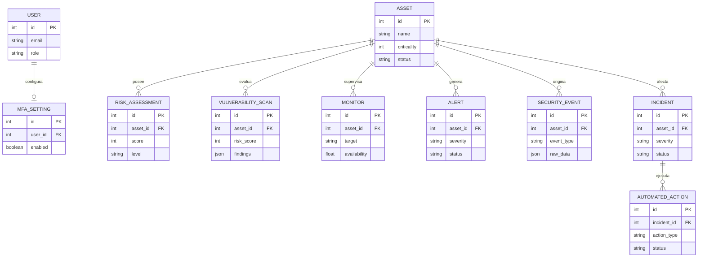
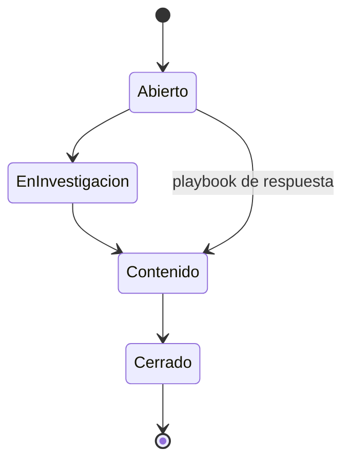

# Modelo de datos

## Diagrama entidad-relación

Entidades independientes: `ComplianceControl`, `EvidenceDocument`, `AuditLog` y `ReportSnapshot`.

## Catálogo

| Entidad | Finalidad | Retención recomendada |
| --- | --- | --- |
| User / MfaSetting | Identidad local y segundo factor | Mientras la cuenta esté activa |
| Asset | Inventario y criticidad | Vida del activo más auditoría |
| RiskAssessment | Riesgo inherente/evaluado | Histórico anual o política aplicable |
| VulnerabilityScan | Resultado y hallazgos JSONB | Según plan y requisito de auditoría |
| Monitor / Alert | Disponibilidad y excepciones | Ventana operativa definida |
| ComplianceControl | Estado de marcos normativos | Al menos un ciclo de auditoría |
| EvidenceDocument | Evidencia almacenada | Política documental y legal |
| SecurityEvent | Eventos SOC/SIEM | Según capacidad y regulación |
| Incident / AutomatedAction | Respuesta y acciones | Política de incidentes |
| AuditLog | Actor, acción, recurso, IP y metadatos | Inmutable durante período normativo |
| ReportSnapshot | PDF mensual en base64 | Según plan de reportes |

## Ciclo del incidente

## Integridad

- Eliminar un activo elimina sus riesgos; diagnósticos, monitores, alertas, eventos e incidentes conservan su registro con referencia nula.
- Eliminar un incidente elimina sus acciones; eliminar un usuario elimina su configuración MFA.
- `framework + code` es único en cumplimiento y `period` es único en reportes mensuales.
- `JSONB` conserva hallazgos y datos crudos, pero exige validación y límites en la capa de aplicación.
