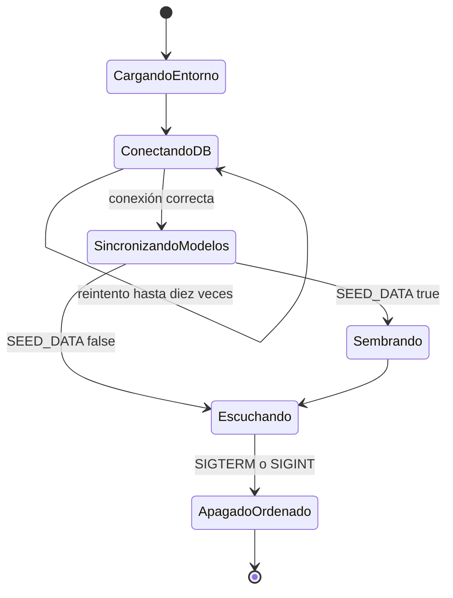
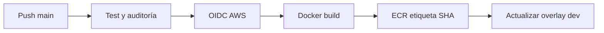

# Desarrollo, pruebas y entrega

## Requisitos

- Node.js 22.13 o superior y npm.
- PostgreSQL accesible.

```bash
npm ci
cp .env.example .env
npm run dev
```

## Configuración

| Variable | Uso | Obligatoria |
| --- | --- | --- |
| `DATABASE_URL` | Conexión PostgreSQL | Sí |
| `JWT_SECRET` | Firma JWT y estados OIDC | Sí |
| `ADMIN_EMAIL`, `ADMIN_PASSWORD` | Usuario inicial si no existe | Para bootstrap |
| `CORS_ORIGINS` | Orígenes permitidos separados por coma | Sí en producción |
| `SEED_DATA` | Semillas iniciales | No |
| `PORT` | Puerto HTTP; 8000 por defecto | No |
| `OPENAI_API_KEY`, `OPENAI_MODEL` | Proveedor generativo opcional | No |
| `OIDC_ISSUER`, `OIDC_CLIENT_ID`, `OIDC_CLIENT_SECRET`, `OIDC_REDIRECT_URI` | Login OAuth2/OIDC | No |

No reutilice los valores de ejemplo en producción.

## Pruebas

```bash
npm test
npm audit --audit-level=high
```

Vitest, Supertest y pg-mem validan rutas, autenticación y reglas sin depender de una base externa. Para cambios en scanner o integraciones agregue pruebas de timeout, error remoto, destinos bloqueados y respuesta válida.

## Docker

```bash
docker build -t ciberguate-backend:local .
docker run --rm -p 8000:8000 --env-file .env ciberguate-backend:local
```

Para una ejecución integrada use `docker compose` desde el repositorio GitOps.

## Inicio y apagado



## CI/CD



La imagen se identifica con el SHA completo del commit para conservar trazabilidad. No use `latest` en manifiestos desplegables.

## Criterios de aceptación

- `npm test` y auditoría pasan.
- `/health` confirma conexión PostgreSQL.
- `/api/openapi.json` representa rutas nuevas o modificadas.
- Las mutaciones sensibles generan auditoría.
- No aparecen secretos ni datos simulados presentados como resultados reales.
