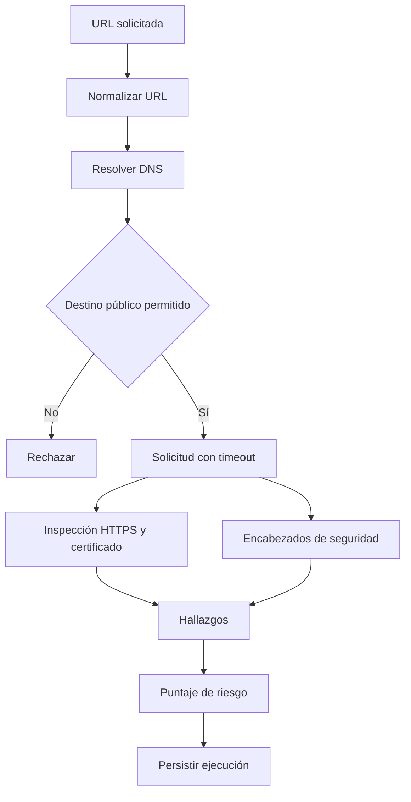
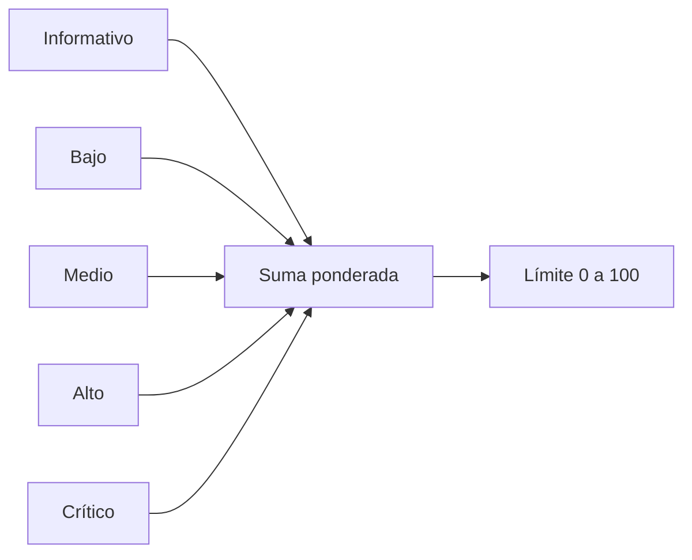

# Motor de diagnóstico web

## Alcance real

El scanner realiza una evaluación web segura y no intrusiva sobre un objetivo autorizado. Examina conectividad HTTPS, TLS, redirecciones y encabezados de seguridad; persiste cada hallazgo, severidad, explicación y recomendación.

No realiza explotación, enumeración profunda, búsqueda completa de CVE, escaneo de puertos ni sustituye herramientas como DAST autenticado, SAST, Nuclei, ZAP o un pentest profesional.

## Flujo

## Controles evaluados

- Uso y redirección a HTTPS.
- Validez y propiedades observables de TLS/certificado.
- Encabezados como HSTS, CSP, protección de MIME, framing y política de referencia.
- Exposición de información relevante en la respuesta.
- Estado HTTP y disponibilidad del objetivo.

Consulte `src/services/scanner.js` para la lista exacta vigente; el reporte debe coincidir con los hallazgos devueltos por esa ejecución.

## Puntuación

El puntaje agregado deriva de la severidad de los hallazgos y está limitado a 0–100. `findings_count` es la longitud de la colección persistida. Por tanto, un resultado de “7 hallazgos” debe mostrar exactamente siete elementos en el detalle.

## Defensa SSRF y uso responsable

- Rechaza esquemas distintos de HTTP/HTTPS.
- Resuelve el host y bloquea loopback, redes privadas, link-local y destinos internos.
- Aplica timeouts y límites de tamaño.
- No siga ampliando el alcance hacia hosts diferentes sin volver a validarlos.
- El operador debe tener autorización expresa del propietario del objetivo.

## Interpretación

Un puntaje alto señala mayor exposición observable; no prueba compromiso. Un resultado limpio sólo significa que los controles incluidos no generaron hallazgos en ese momento.
