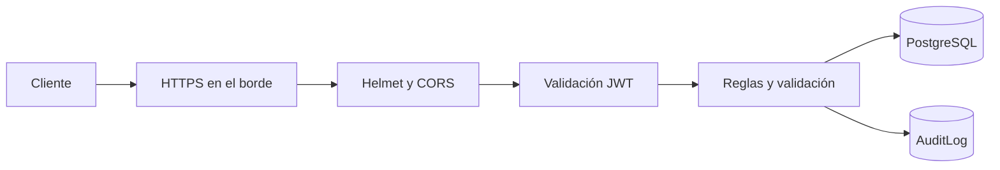

# Seguridad del Backend

## Capas de control

## Identidad

- Contraseñas con bcrypt; nunca se almacena el valor en claro.
- JWT de acceso con emisor, audiencia y vencimiento de ocho horas.
- Desafío MFA separado, limitado a cinco minutos, y TOTP opcional.
- OAuth2/OIDC configurable mediante discovery, `state` firmado y callback de código.
- Cambio de contraseña exige la contraseña actual y mínimo de ocho caracteres.

La versión actual incluye un campo `role`, pero no implementa autorización granular por rol. Todo endpoint protegido debe considerarse accesible a cualquier usuario autenticado hasta agregar middleware RBAC y pruebas asociadas.

## Modelo de amenazas

| Amenaza | Control actual | Pendiente recomendado |
| --- | --- | --- |
| Fuerza bruta | Hash bcrypt y MFA opcional | Rate limit/bloqueo progresivo |
| Robo de JWT | Expiración, issuer y audience | Rotación/denylist y cookies HttpOnly si cambia el cliente |
| SSRF del scanner | Resolución y bloqueo de redes internas | Proxy de salida y política egress dedicada |
| Inyección SQL | Sequelize y validación | Validadores por esquema en todas las rutas |
| Abuso de archivos | Límite JSON de 1 MB | Almacenamiento de objetos, antivirus y allowlist MIME |
| Exposición de errores | Respuesta `detail` controlada | Correlación y logger estructurado |
| Privilegios excesivos | API autenticada | RBAC y separación administrador/analista/auditor |
| Manipulación de auditoría | Registro de acciones | Almacenamiento inmutable/exportación SIEM |

## Secretos

`JWT_SECRET`, credenciales PostgreSQL, `ADMIN_PASSWORD`, secreto OIDC y `OPENAI_API_KEY` provienen del entorno administrado. No deben aparecer en Git, imágenes, documentación, logs ni respuestas.

## Auditoría

Las mutaciones críticas registran actor, acción, recurso, IP y metadatos. La auditoría es evidencia operacional, pero se recomienda exportarla a almacenamiento inmutable con retención definida.

## Respuesta HTTP

Helmet establece encabezados defensivos; CORS sólo acepta `CORS_ORIGINS`. En producción, el proxy termina TLS y la API no se expone directamente fuera del clúster.
