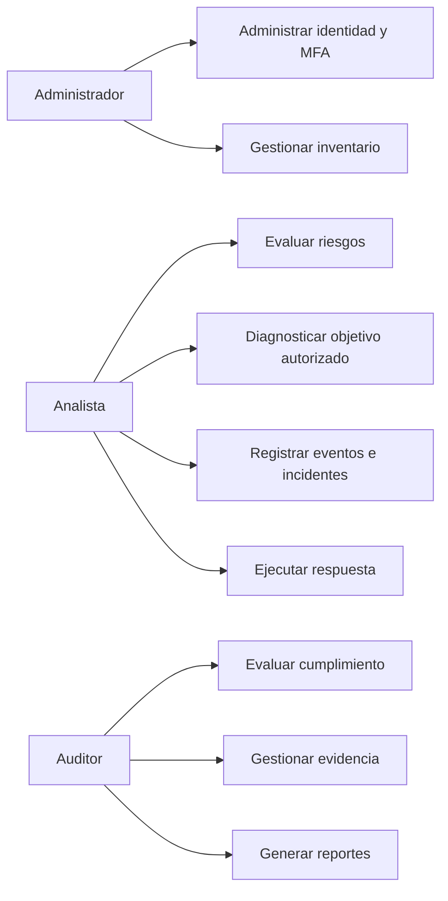
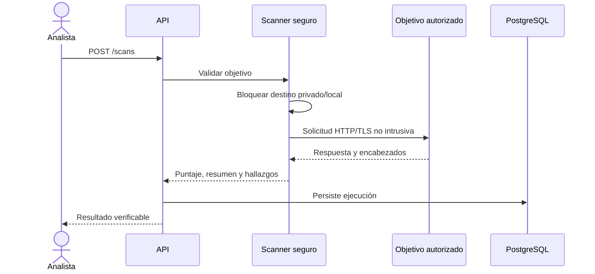
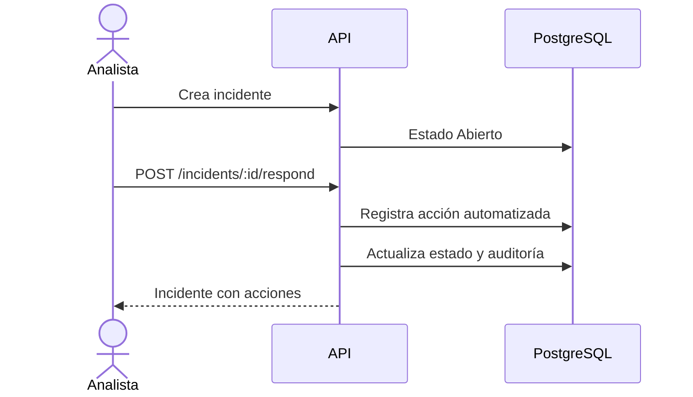

# Casos de uso

## Mapa funcional

## UC-01 Registrar activo

1. Un usuario autenticado envía nombre, tipo, propietario, ubicación y criticidad.
2. La API valida el rango de criticidad y persiste el activo.
3. Registra `ASSET_CREATED` en auditoría.
4. Devuelve el recurso con identificador.

## UC-02 Evaluar riesgo

1. El usuario selecciona un activo y registra amenaza, probabilidad e impacto.
2. El servicio calcula `score` y nivel, y normaliza la función NIST.
3. Persiste la evaluación y el evento de auditoría.
4. Dashboard y recomendaciones incorporan el nuevo resultado.

## UC-03 Ejecutar diagnóstico

## UC-04 Evaluar cumplimiento

La evaluación automática correlaciona la evidencia disponible con controles. El usuario puede revisar estado, puntaje, responsable y evidencia. Toda actualización conserva fecha de revisión y auditoría.

## UC-05 Responder a incidente

Las acciones de la versión actual son registros de playbook dentro de la plataforma; integrar aislamiento real, firewall o EDR requiere conectores autorizados adicionales.

## UC-06 Emitir evidencia

El usuario consulta el historial, genera/descarga PDF y contrasta período, totales y detalle. Los snapshots mensuales permiten reproducibilidad posterior.
